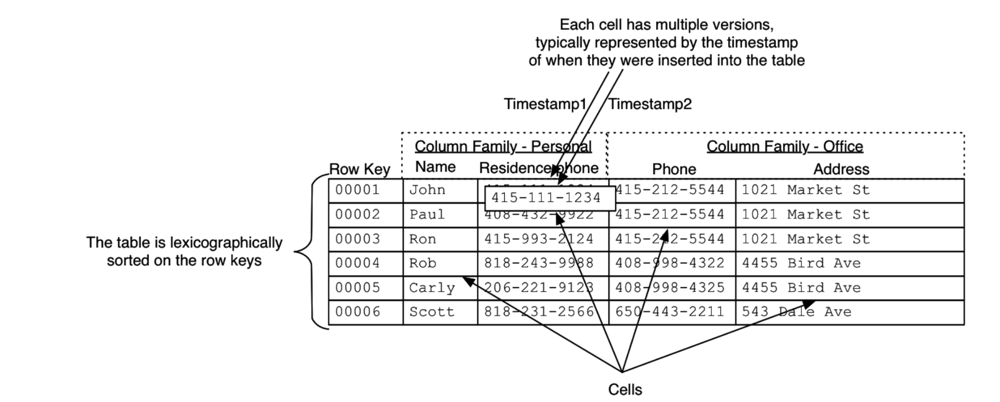

# Databases

## Acronyms
**C**reate **R**ead **U**pdate **D**elete

**A**tomicity - Each transaction (which can be composed of multiple statements) either succeeds completely or fails completely 
**C**onsistency - A transaction can only bring the database from one valid state to another, maintaining all database invariants 
**I**solation - Concurrent transactions leave the database in the same state that would have been obtained had the transactions been performed sequentially 
**D**urability - Once a transaction has been committed, it will remain committed even in the case of a system failure 

## Apache HBase
- Distributed key-value NoSQL store
- Fast random read/write access
- Built for wide tables; HBase is horizontally scalable

### Data Model
- Sparse, distributed, persistent multidimensional sorted map
  - (row-id, column-family, column-qualifier, timestamp) -> value
  - Column families are fixed (during table creation)
  - Column qualifiers are specified on the fly
- Everything is byte array, except timestamp, which is long (not necessarily wall clock timestamp)
- A table is split into "regions" based on row-id ranges
  - HBase will auto-split large regions
  - User can manually merge regions
- Tables are grouped in namespaces `namespace:table_name`
- [Introduction to HBase Schema Design](http://0b4af6cdc2f0c5998459-c0245c5c937c5dedcca3f1764ecc9b2f.r43.cf2.rackcdn.com/9353-login1210_khurana.pdf)

